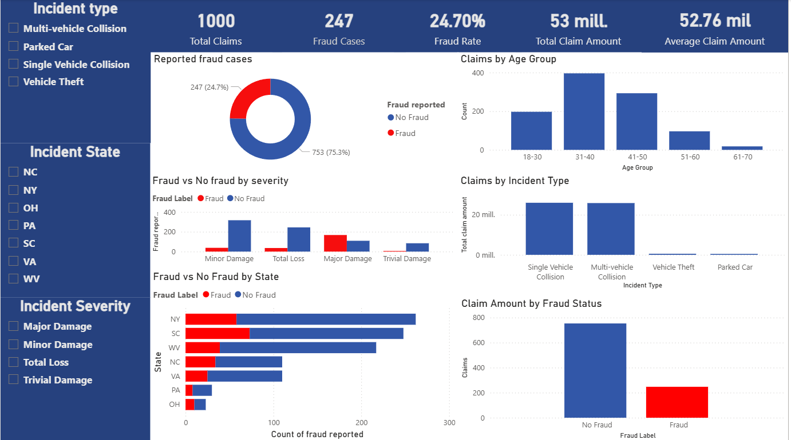

# Insurance Fraud Detection Dashboard
---
## Dashboard preview


---
## Project Overview

This project analyzes **insurance claim data** to identify patterns associated with **fraudulent claims**.  
Using **Python for data cleaning and exploratory data analysis (EDA)** and **Power BI for visualization**, the project highlights fraud indicators, claim distributions, and potential risk patterns across multiple variables.

The objective of this project is to demonstrate practical skills in:

- Data cleaning and preprocessing
- Exploratory data analysis
- Fraud pattern identification
- Business intelligence dashboard development

This project is part of a **data analytics and actuarial portfolio focused on insurance risk analysis**.

---

# Project Objectives

The main objectives of this analysis are:

- Analyze insurance claim data
- Identify patterns associated with **fraudulent claims**
- Explore relationships between:
  - claim severity
  - incident type
  - customer age
  - geographic location
- Develop an **interactive Power BI dashboard** for data-driven insights

---

# Dashboard Features

The Power BI dashboard provides a comprehensive overview of claim activity and fraud indicators.

### Key Performance Indicators (KPIs)

- **Total Claims:** 1000
- **Fraud Cases:** 247
- **Fraud Rate:** 24.7%
- **Total Claim Amount:** 53M+
- **Average Claim Amount:** 52.7K+

---

### Main Visualizations

The dashboard includes several analytical views:

• **Fraud vs Non-Fraud Distribution**  
Shows the proportion of fraudulent vs legitimate claims.

• **Claims by Age Group**  
Analyzes claim frequency across customer age groups.

• **Fraud vs Non-Fraud by Incident Severity**  
Examines how fraud cases are distributed across different levels of claim severity.

• **Claims by Incident Type**  
Shows which types of incidents generate the largest claim amounts.

• **Fraud vs Non-Fraud by State**  
Highlights geographic distribution of fraud cases and claim activity across states.

• **Claim Amount by Fraud Status**  
Compares the number of claims between fraudulent and legitimate cases.


# Data Preparation

Data preprocessing and cleaning were performed using **Python and Pandas**.

Key steps included:

- Handling missing values
- Cleaning categorical variables
- Converting binary indicators:
  - `property_damage`
  - `police_report_available`
  - `fraud_reported`
- Creating analytical features:
  - **Fraud Label**
  - **Age Groups**
- Preparing the dataset for visualization in Power BI

---

# Exploratory Data Analysis

Exploratory analysis was conducted to understand the structure and behavior of the data.

The analysis included:

- Customer age distribution
- Fraud case distribution
- Incident severity analysis
- Claim amount vs fraud status
- Claims by geographic location
- Incident type frequency

These insights guided the design of the Power BI dashboard.

---

# Key Insights

The analysis reveals several interesting patterns:

• Approximately **24.7% of claims show fraud indicators**.

• Fraudulent claims appear more frequently in **major damage incidents** compared to minor damage claims.

• The most common incident types are:

- Single vehicle collisions
- Multi-vehicle collisions

• Most claims occur among customers aged **31–50 years old**.

• Fraud distribution varies across states, suggesting **possible regional risk patterns**.

---

# Tools & Technologies

This project was developed using the following tools:

- **Python**
- Pandas
- Matplotlib
- Seaborn
- **Power BI**
- Git
- GitHub

---

# Project Structure
 ```
insurance-fraud-dashboard
│
├── data
│ ├── insurance_claims.csv
│ └── insurance_fraud_dashboard.csv
│
├── scripts
│ └── lifeinsurance.py
│
├── dashboard
│ └── Analysis_fraud.pbix
│
├── images
│ └── Fraud_Dashboard.png
│
└── README.md
```
 

---

#  Future Improvements

Possible extensions of this project include:

- Building a **machine learning model to predict fraud probability**
- Creating **fraud risk scoring models**
- Adding **time-series claim analysis**
- Deploying the dashboard through **Power BI Service**

---

#  Author

**Oscar Salgado**

Projects focused on **data analysis, insurance analytics, fraud detection, and actuarial insights**.

GitHub:  
https://github.com/osalgador

---

#  Project Purpose

This project was developed as part of a **data analytics and actuarial portfolio**, demonstrating practical skills in:

- Data cleaning
- Exploratory data analysis
- Fraud detection analysis
- Data visualization
- Insurance risk analysis
